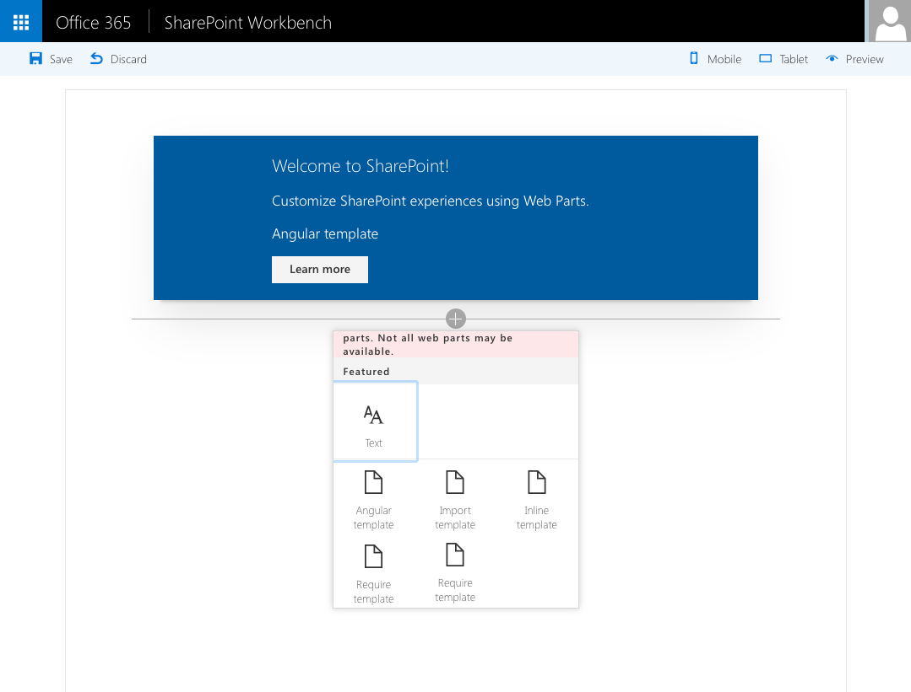

# Loading Angular templates in SharePoint Framework Client-Side Web Part

This sample illustrates the different techniques for loading templates in SharePoint Framework Client-Side Web Parts built using Angular.

## Minimal Path to Awesome

- clone this repo
- `$ npm i`
- `$ gulp serve`

## Features

This sample illustrates the following concepts on the SharePoint Framework:

- defining HTML template for the Angular application in a Client-Side Web Part
  - in-line, mixed with the Web Part's code
  - externally in a static HTML file using global CSS classes
  - externally in a TypeScript file using unique CSS classes
  - externally in a static HTML file using unique CSS classes mapped via Angular view model
  - externally loaded through Angular
- passing the unique CSS class names into Angular template
- extending the SharePoint Framework project build process using custom build tasks
- loading Angular from CDN